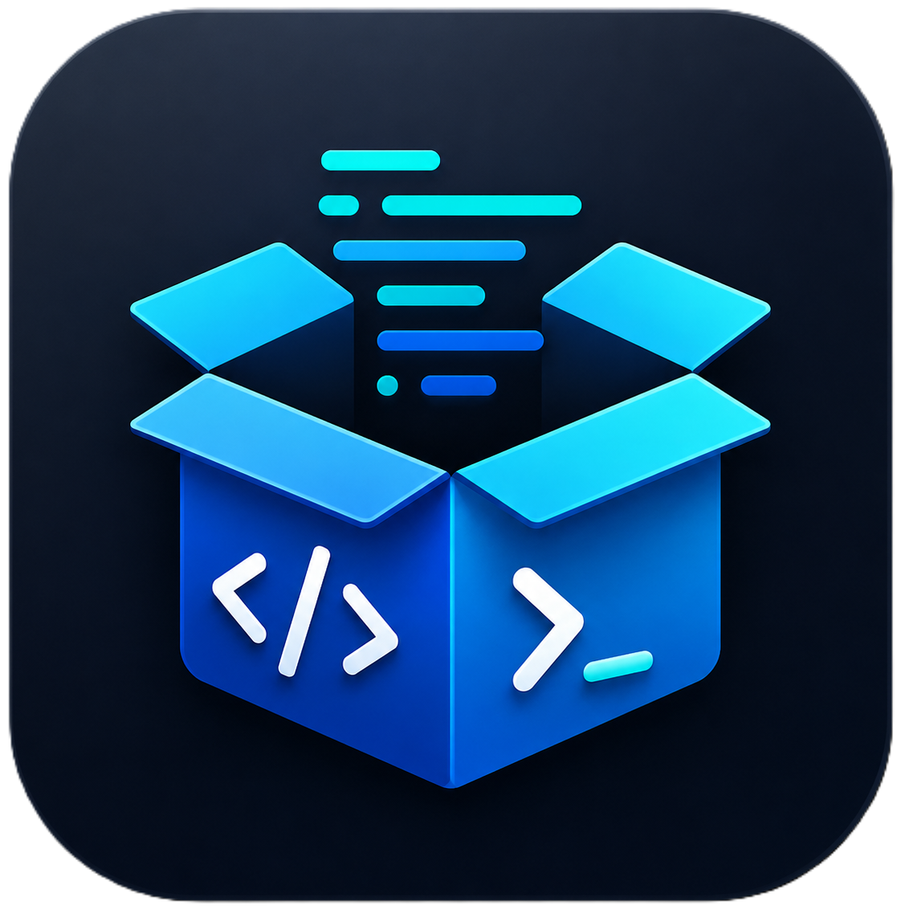

# ScriptBox

ScriptBox is a portable Windows PowerShell launcher with a friendly, category-based UI. Every script has an information view, clear privilege and policy badges, confirmation, automatic UAC elevation when required, live terminal output, and a plain-language result window.



## Run it

Open Windows PowerShell and run:

```powershell
irm https://raw.githubusercontent.com/GoblinRules/ScriptBox/main/ScriptBox.ps1 | iex
```

ScriptBox does not install itself. The initial launcher fetches only the UI/catalog and icon—not every catalog script. A script file is downloaded into memory only after the user selects **RUN** and accepts its confirmation. Temporary output is kept in a uniquely named Windows temporary folder and removed when the app closes. Scripts launched from the catalog may make their own documented system changes or install/open third-party tools.

> `irm | iex` executes code from the internet. Review [`ScriptBox.ps1`](ScriptBox.ps1) and the source URLs shown by each script before running it.

## Included sections

- **Power** — restart, always-on power, and locked-session network availability.
- **Warning - Use With Caution** — shut down Windows or schedule an unattended protected erase-and-reinstall workflow.
- **Security** — hide power commands, enforce a ten-minute idle lock, and allow password sign-in without removing Windows Hello PINs.
- **Windows** — location services, supported IPv6 component policy, and persistent machine-wide audio suppression.
- **Remote Access** — enable RDP, NLA, firewall access, and the signed-in user.
- **Windows Update** — choose security-focused automatic updates or completely manual updates.
- **Software** — install or update the core Ninite application bundle.
- **Utilities** — deploy the matching Laptop Lid Check popup and Public Desktop shortcut.
- **Tools** — launch JetFuel, InvokeX, or Chris Titus Tech Windows Utility from their current remote source.
- **Diagnostics** — test either the viewer-side Tailscale path to a KVM or the KVM-site router, NAT, firewall, and UDP conditions.
- **BIOS** — conservative HP, Dell, and Lenovo commercial-device configuration helpers.

Use **i** to inspect impact, elevation, execution-policy behavior, and the exact on-demand source. Use **RUN** for one task. Tick **SELECT** on several cards and choose **RUN SELECTED** to execute them sequentially. ScriptBox prevents conflicting update modes, BIOS vendors, and simultaneous restart/shutdown selections. Scripts that need administrator rights trigger Windows UAC automatically. Only catalog entries marked as requiring a policy bypass receive `-ExecutionPolicy Bypass`, and only for their child PowerShell process.

After a feedback-producing script finishes, ScriptBox translates its output into **Good**, **Review**, and **Problems** counts with a plain-language summary. Full terminal details remain visible in the same matching result window. A multi-script queue produces one combined result at the end.

## Add or edit a script

All executable bodies live as standalone files in [`scripts`](scripts). The clearly marked `SCRIPT CATALOG` array in [`ScriptBox.ps1`](ScriptBox.ps1) contains only small metadata entries and source references. Add a script file, then add its card:

```powershell
New-CatalogItem `
    -Id 'my-script' `
    -Name 'My Script' `
    -Category 'Maintenance' `
    -Description 'Explains the result in one sentence.' `
    -ScriptPath 'My-Script.ps1' `
    -Impact 'Describes exactly what changes.' `
    -RequiresAdmin $false `
    -NeedsBypass $false `
    -RequiresConfirmation $true `
    -InputTitle '' `
    -InputMessage '' `
    -InputVariable '' `
    -InputOptional $false `
    -InputSecret $false `
    -ResultMode 'Summary' `
    -SuccessMessage 'Explains success in plain language.' `
    -ConflictGroup '' `
    -CanQueue $true `
    -ShowInAllScripts $true `
    -Accent '#22D3EE'
```

Categories and counts are generated automatically. `ScriptPath` resolves under the repository `scripts` folder and is fetched only when that card runs. `SourceUri` can instead point at an external HTTPS PowerShell launcher. Set the input fields when a script needs one value before launch; secret input is masked and never written to ScriptBox output. Give mutually exclusive cards the same `ConflictGroup`. Delete a metadata entry and its standalone file to remove a script.

Set `CanQueue` to `$false` for an action that must only be run by itself. Its card will not offer the **SELECT** control.

Set `ShowInAllScripts` to `$false` for an action that should appear only inside its named section. Warning actions use this setting so they do not appear in **All scripts** or its search results.

## Design and safety notes

- Windows PowerShell 5.1 and WPF are already included with supported desktop versions of Windows.
- PowerShell 7 launches a short Windows PowerShell STA handoff because WPF requires an STA thread; the handoff itself does not use a policy bypass.
- Script output is streamed from a temporary UTF-8 log and removed after completion or app shutdown.
- Multi-selection runs sequentially, avoiding simultaneous registry, policy, installer, and firmware changes.
- Restart and shutdown can be cancelled during their countdown with `shutdown /a`.
- **Unattended Erase and Reinstall** requires the exact phrase `ERASE ALL INTERNAL DATA` and administrator approval. It refuses unsupported editions and Windows Server, validates Microsoft RemoteWipe as Local System, then schedules `doWipeProtectedMethod` after a 60-second cancellation window. A missed trigger does not run later after a boot or wake. If Microsoft rejects the scheduled request, a diagnostic status file remains in `%SystemRoot%\Temp`; a successful wipe removes it with the disk contents. The protected wipe cleans the entire internal Windows disk, including a `D:` partition on that disk, and reinstalls Windows without additional reset prompts. Microsoft warns that some device configurations may become unbootable if recovery fails. Keep the device on AC power and have its BitLocker recovery key available. Windows stops at first-run setup afterward unless the device has an Autopilot/MDM provisioning path.
- Remote launchers can change independently. Their entries are marked clearly and require confirmation.
- The KVM diagnostics make no network, firewall, Tailscale, or router changes. By default, each saves a timestamped text report to the current user's Downloads folder.
- Do not add passwords, tokens, private URLs, or other secrets to this public repository.

## Validate a change

Parse the launcher and every standalone script without running them:

```powershell
$files = @('.\ScriptBox.ps1') + @(Get-ChildItem .\scripts\*.ps1)
foreach ($file in $files) {
    $errors = $null
    [void][System.Management.Automation.Language.Parser]::ParseFile(
        (Resolve-Path $file), [ref]$null, [ref]$errors
    )
    $errors
}
```

Validate both standalone KVM diagnostics without running network tests:

```powershell
powershell.exe -NoProfile -File .\scripts\KvmClientTailscaleDiagnostics.ps1 -ValidationOnly -NonInteractive
powershell.exe -NoProfile -File .\scripts\KvmSiteNetworkDiagnostics.ps1 -ValidationOnly -NonInteractive
```

Load and validate the UI without showing the window or running a catalog item:

```powershell
$env:SCRIPTBOX_TEST_MODE = '1'
powershell.exe -NoProfile -STA -ExecutionPolicy Bypass -File .\ScriptBox.ps1
Remove-Item Env:\SCRIPTBOX_TEST_MODE
```

## License

[MIT](LICENSE)
